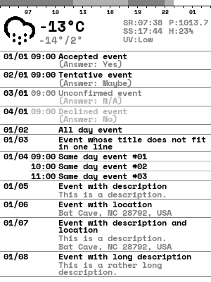

# e-Ink organiser



A simple interface showing the weather forecast and upcoming events, shown in an
[e-Paper display](https://www.waveshare.com/wiki/4.2inch_e-Paper_Module) powered by a RPi Zero W.

## How does it work

Every fifteen minutes, it pulls the upcoming events from [Google Calendar](https://developers.google.com/calendar) and
weather forecast from [Open Weather Map](https://openweathermap.org/), writing it all into a simple UI on a 300x400
greyscale image, using a custom [font](https://fonts.google.com/specimen/Space+Mono) and
[icons](http://adamwhitcroft.com/climacons/). Then it compresses the image to 2-bit shades of grey and, using the RPi's
SPI interface, sends the data to the display.

## Usage

First, install the required dependencies by running `pip install requirements.txt`. Then, you need to get credentials
and configure both the calendar and weather modules. More detailed instructions can be found in each of those modules.

After all that, simply run `python main.py`, which will activate a 15 minute schedule to update the screen.

This works as long as the RPi stays powered on, but if you want to start the program every time the device turns on you
can do as I did and configure a cron job. Simply type `crontab -e` on a terminal and edit as desired. Here is my
configuration as an example:
```text
# * * * * * command to execute
# │ │ │ │ └ day of the week (1 - 7 Mon to Sun; or 0 - 6 Sun to Sat)
# │ │ │ └── month (1 - 12)
# │ │ └──── day of the month (1 - 31)
# │ └────── hour (0 - 23)
# └──────── minute (0 - 59)
#
# @reboot, @yearly, @monthly, @weekly, @daily, @hourly can be used instead of
# the pattern.
# Do not forget new line at the end of the file!
# See crontab.guru for help.
PATH="/usr/local/sbin:/usr/local/bin:/usr/sbin:/usr/bin:/sbin:/bin:"
MAILTO=""

@reboot python /home/pi/organiser/main.py

```

## Modules

* [Calendar](modules/calendar): All code related on fetching the upcoming events from the cloud.
* [Display](modules/display): Hardware abstraction layer between the RPi / e-Paper and the rest of the program.
* [Weather](modules/weather): Open Weather Map forecast REST API wrapper, allowing to fetch info on current and upcoming
weather.
* [Organiser](modules/organiser): Master class, using the other modules to create the user interface.
